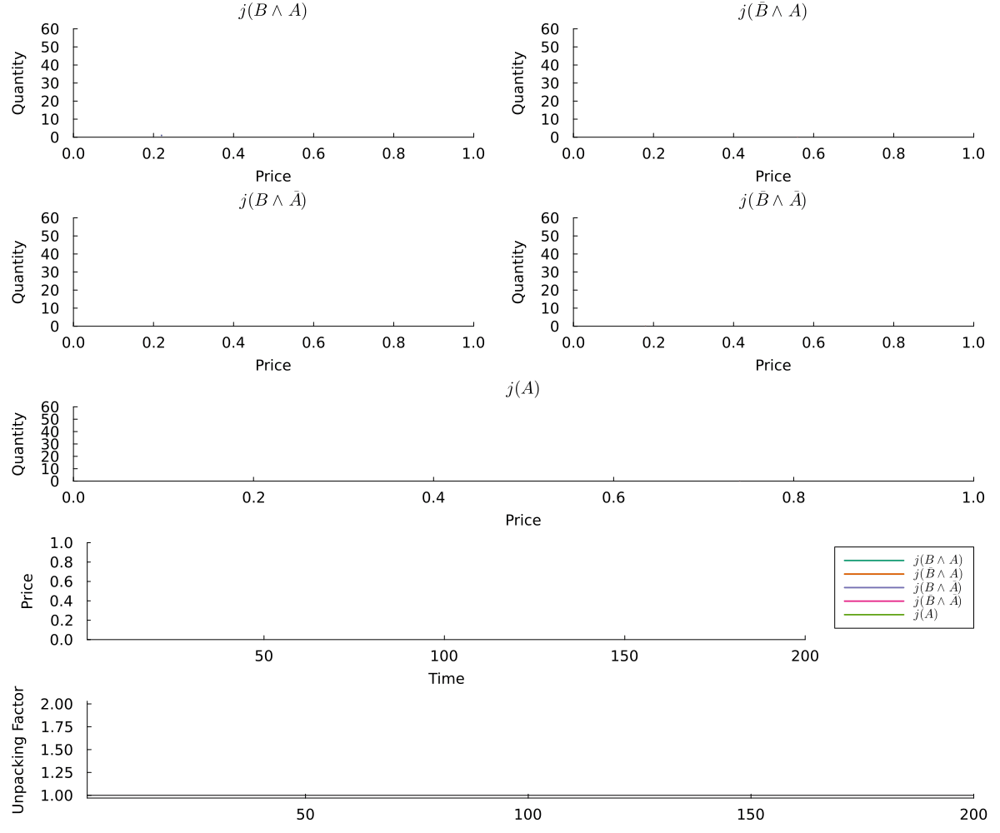

# ABMPredictionMarkets

This project contains an API for creating agent-based models of prediction markets. More details can be found by navigating the menu on the left-hand side.

```@raw html

```
```@raw html
<details>
<summary><b>Show Details </b></summary>
```
```julia 
using Random
using Agents
using Plots
using ABMPredictionMarkets
Random.seed!(568)

n_agents = 200
model = initialize(
    TestAgent;
    n_agents,
    μ = [0.20, 0.25, 0.10, 0.45],
    η = 20.0,
    money = 50000,
    δ = 3,
    info_times = Int[],
    n_markets = 5
)

animation = plot_dashboard(model)
gif(animation, "temp.gif", fps = 8)
```
```@raw html
</details>
```
